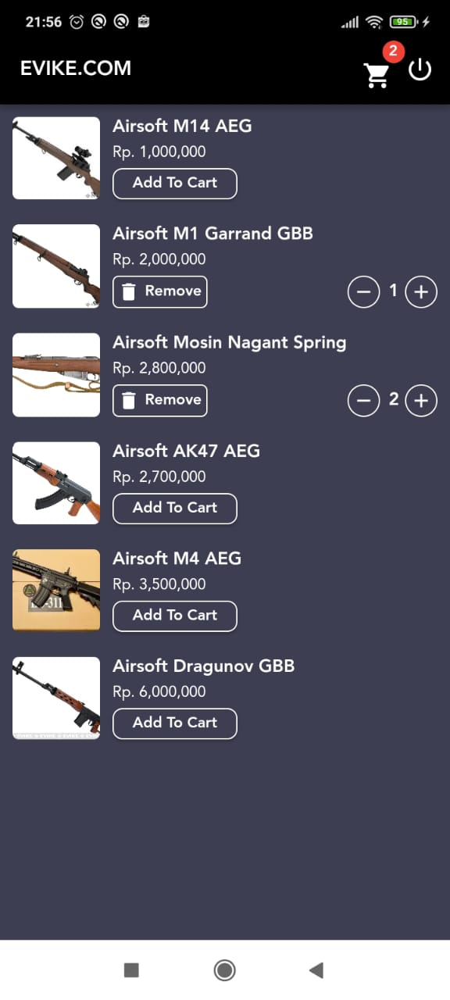
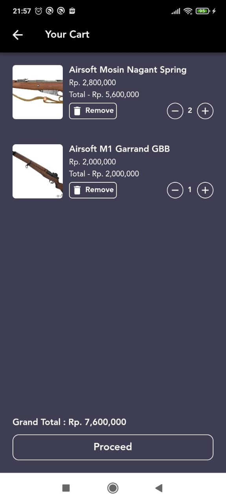

# Cart App

Aplikasi Cart menggunakan  GetX State Management
dan Obx untuk mengupdate UI Widget
serta menggunakan GetStorage untuk penyimpanan local

Untuk input password email dan nama itu bebas,kalian bisa masukkan apa saja
aplikasi ini tidak terkoneksi API Login

Aplikasi dibuat menggunakan Flutter versi 2.10.5

 Selamat Mempelajari dan semoga bermanfaat :D

 Screen Shoot Aplikasi

 
 

